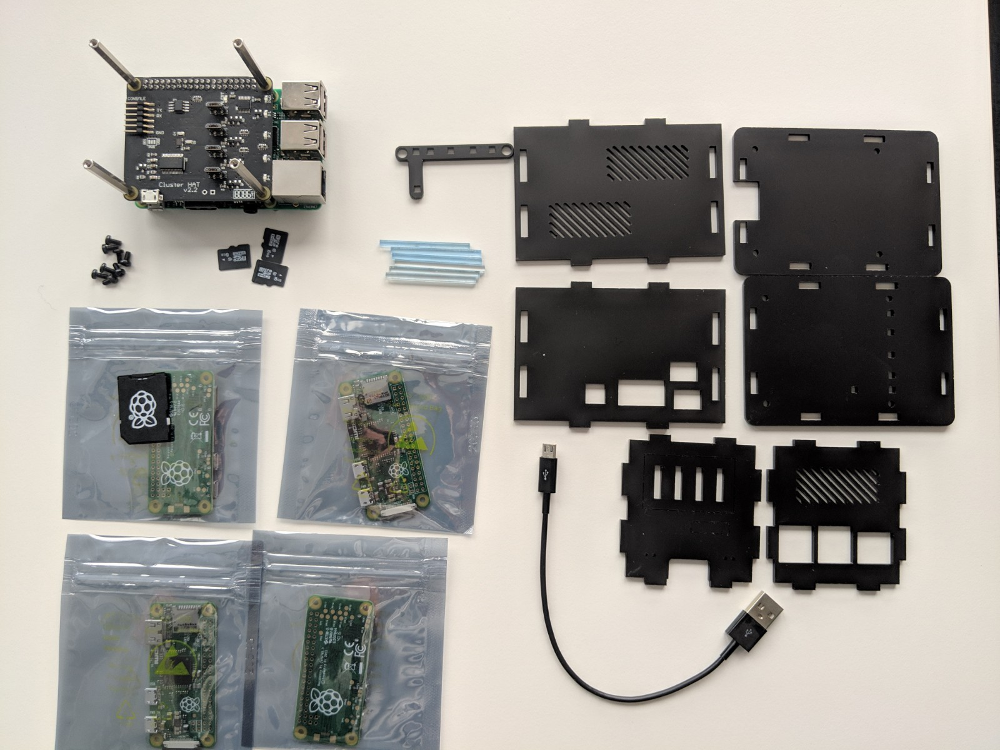

# Raspberry Swarm Box

Instructions to build a Raspberry Pi powered Docker Swarm mini cluster in a box.

## Bill of Material

Well, first you need to buy the hardware. Here is the list of what I bought.

* Raspberry Pi 3 Model B+ (https://www.modmypi.com/raspberry-pi/set-up-kits/rpi3-model-b-plus-kits/raspberry-pi-3-model-b-plus-and-16gb-microsd-bundle)
* Cluster HAT Kit Inc. 4 x Raspberry Pi Zero (https://www.modmypi.com/raspberry-pi/iousbanalogue-expansion-1028/interfacing-1080/cluster-hat-kit-inc.-4-x-raspberry-pi-zero)
* Cluster HAT Case (https://www.modmypi.com/raspberry-pi/cases-183/raspberry-pi-b-plus2-and-3-cases-1122/cases-for-hats-and-boards-1133/cluster-hat-case)

## Assembly

This is the fun part. Basically unpack everything and put all the parts together.
Have a look into the `assembly/` directory for more images.



## Node Setup

This section is about setting up all five Raspberry Pi nodes with the required software. First up, make sure that you download
the Raspbian images from the ClusterHAT website: https://clusterhat.com/setup-software

Since we want the Zero nodes to be able to access the internet, make sure you download the NAT Desktop controller image! Write all
the images to a SD card using balenaEtcher or a similar software. Also make sure to insert the appropriate SD card into the right
Raspi Zero slot.

### Controller Node Setup

Once switched on, perform the following steps after the first boot
- following the basic setup instructions (locale, network and wireless LAN, password, update)
- after the next reboot, open the Raspi configuration in a shell using `sudo rasp-config`
- make sure you extend the partition to the full size of your SD card! 
- enable SSH

Before you continue with the following steps, make sure you have performed the basic setup of all four Zero nodes.
In a terminal, issue the following commands:
```
clusterhat on

ssh-keygen 
ssh-copy-id -i ~/.ssh/id_rsa pi@172.19.181.1
ssh-copy-id -i ~/.ssh/id_rsa pi@172.19.181.2
ssh-copy-id -i ~/.ssh/id_rsa pi@172.19.181.3
ssh-copy-id -i ~/.ssh/id_rsa pi@172.19.181.4
```

To make working with the nodes a little easier, edit your `/etc/hosts` file and add the following:
```
172.19.181.254  master cnat
172.19.181.1    p1
172.19.181.2    p2
172.19.181.3    p3
172.19.181.4    p4
```

If you want to develop and compile your Go based services on the controller node, you need to install Go.
```
sudo apt-get install -y vim

cd /tmp/
wget https://dl.google.com/go/go1.12.1.linux-armv6l.tar.gz

sudo mkdir -p /usr/local/go
sudo tar -xvf /tmp/go1.12.1.linux-armv6l.tar.gz -C /usr/local/go --strip-components=1
```

### Zero Node Setup

On the controller node, open a terminal and perform the following commands for each Zero (p1, p2, p3, p4).
The user is `pi` and the initial password is `clusterhat`. 

```
clusterhat on p1
minicom p1
sudo raspi-config
```

In the configuration, 
- make sure you extend the partition to the full size of your SD card! 
- enable SSH
- change the root password
- reduce the memory split to 16MB
- adjust the locale and timezone settings
- update the system

When all changes are done, perform a reboot of the node. You should be able to login via SSH now.


## Docker (Swarm) Setup

### Install Docker

The Docker setup is slightly complicated. The problem is, that the current versions of Docker do not run on the Rasperry Pi Zeros anymore! Make
sure you follow the Github issue https://github.com/moby/moby/issues/38175 to get the latest status. As of this writing, you need to use 18.06.*

1. On each node, ensure that there is a file `/etc/apt/sources.list.d/docker.list` with the following content, create it otherwise.
```
deb [arch=armhf] https://download.docker.com/linux/raspbian stretch stable
```

2. On each node, ensure that there is a file `/etc/apt/preferences.d/docker-ce` with the following content, create it otherwise.
```
Package: docker-ce
Pin: version 18.06.*
Pin-Priority: 1000
```

3. On each node, install the Docker package using: 
```
sudo apt-get -y install docker-ce=18.06.2~ce~3-0~raspbian
sudo usermod -aG docker pi
```

### Create Docker Swarm

First, you need to initialize the swarm on the master node. Make sure you use the ClusterHAT internal address.
```
docker swarm init --advertise-addr 172.19.181.254:2377 --listen-addr 172.19.181.254:2377
```

Then on each of the Zero nodes, login via SSH and issue the command that the previous command echoed _(the token will vary!!!)_, e.g.
```
docker swarm join --token SWMTKN-1-6cx6yq79x459o28kwaipsta7y149o2j6p2g0sxjodil249v0o8-daye1lc9blrh2ba2ojxr6k82v 172.19.181.254:2377
```

Once you did this, check the health of your swarm and that all nodes are available. Also you can install a visualizer image. 
```
docker node list
docker service create --name=viz --publish=8080:8080/tcp --constraint=node.role==manager --mount=type=bind,src=/var/run/docker.sock,dst=/var/run/docker.sock alexellis2/visualizer-arm:latest
xdg-open http://master:8080
```

### Using Docker Swarm

```
docker service create --name nginx --publish :80:80 --replicas 1 arm32v6/nginx:1.15.9-alpine
docker service scale nginx=4

docker service create --name alpine --entrypoint sleep 10 --restart-delay 1s --replicas 4 arm32v6/alpine:3.9.2

# pull some useful images if required
docker pull arm32v6/traefik:1.7.9
docker pull arm32v6/consul:1.4.3
docker pull arm32v6/golang:1.12.1-alpine
docker pull arm32v6/nats-streaming:0.12.2-linux
docker pull arm32v6/postgres:11.2-alpine
docker pull arm32v6/nginx:1.15.9-alpine
docker pull arm32v6/alpine:3.9.2
docker pull arm32v6/node:11.11.0-alpine
docker pull arm32v6/eclipse-mosquitto:1.5.8
docker pull arm32v6/haproxy:1.9.4-alpine
docker pull arm32v6/nats:1.4.1-linux
docker pull arm32v6/rabbitmq:3.7-alpine
docker pull arm32v6/rabbitmq:3.7-management-alpine
```

### Troubleshooting

If you have followed the official Docker setup instructions (`curl -sLSf https://get.docker.com | sudo sh`) and you are facing the problem that 
the _containerd_ service does not start on your Zero nodes, you need to remove and purge Docker from the system and follow the instructions above.
```
sudo apt-get purge docker-ce
sudo apt autoremove
sudo rm -rf /var/lib/docker
sudo reboot
``` 

Sometimes the Docker service on the Zero nodes does not start properly and hangs. To solve this, start each node individually. Login to each node
via SSH one by one and perform a `sudo systemctl restart docker`. Once done, restart the Docker service on the controller node as well. Your swarm
should be up and running again.

If your Docker swarm breaks for unknown reasons, and you want to recreate it, issue `docker swarm leave --force` on each node and master. Once you 
have done this, create the swarm again using the above instructions. 

## OpenFaaS Installation

echo "admin" | docker secret create basic-auth-user -
echo "admin" | docker secret create basic-auth-password -
export BASIC_AUTH="false"

docker stack deploy openfaas --compose-file docker-compose.arm64.yml


## Maintainer

M.-Leander Reimer (@lreimer), <mario-leander.reimer@qaware.de>

## License

This software is provided under the MIT open source license, read the `LICENSE`
file for details.
